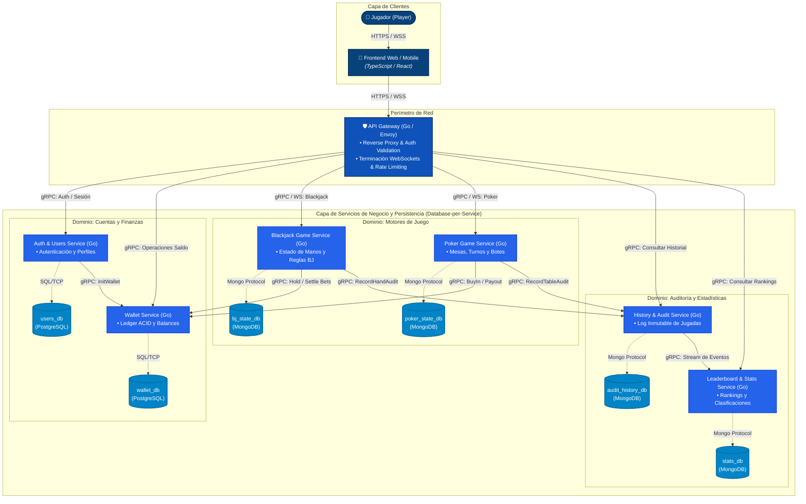

# Especificación y Diseño de Arquitectura Distribuida

## Sistema de Casino Online

* Alex Saez
* Christian Gajardo
* Yoandri Villarroel

### 1. Información General

* **Nombre del Sistema:** Sistema de Casino Online
* **Dominio:** Juegos de azar en línea, gestión transaccional de créditos virtuales y auditoría en tiempo real.
* **Contexto Académico:** Sistemas Distribuidos y Escalables.
* **Propósito:** Sistema de casino online que permite a los usuarios participar en distintos juegos utilizando créditos virtuales, gestionar su saldo y consultar el historial de sus actividades. El sistema contempla juegos de casino generales, con especial consideración de juegos de cartas como Blackjack y Póker.

### 2. Diagrama de Arquitectura Distribuida (Mermaid)

